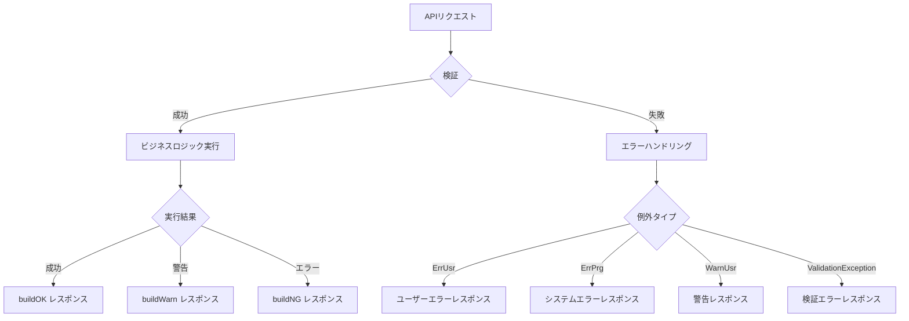

# バックエンド ベースコントローラー

## 概要

このプロジェクトのバックエンドAPIは、すべてのAPIエンドポイントに共通の機能を提供する階層的なコントローラー構造に基づいて構築されています。ベースコントローラーシステムは、特殊な機能のための様々なトレイトを持つ階層的な継承構造で構成されています。

## コントローラー階層

```
Laravel BaseController
     ↑
StubController (ベースコントローラー)
     ↑
ApiController
     ↑
特定のAPIコントローラー
```

## 主要コンポーネント

### 1. StubController

`app/Contracts/Http/Controllers/StubController.php`に位置し、すべてのAPIコントローラーが継承する主要なベースコントローラーです。LaravelのBaseControllerを拡張し、複数の有用なトレイトを組み込んでいます。

```php
namespace W3\Contracts\Http\Controllers;

use Carbon\Carbon;
use Illuminate\Foundation\Bus\DispatchesJobs;
use Illuminate\Foundation\Validation\ValidatesRequests;
use Illuminate\Routing\Controller as BaseController;
use W3\Helpers\Assertions;
use W3\Helpers\JsonResponseFactory;
use W3\Models\Element;
use W3\Models\Unit;
use W3\Models\User;

class StubController extends BaseController
{
    use Assertions, DispatchesJobs, ValidatesRequests, LimitOffsetAware, JsonResponseFactory;

    protected $selectLimitMax = 10000;
}
```

### 2. ApiController

`app/Http/Controllers/API/ApiController.php`に位置し、StubControllerを拡張し、すべてのAPI固有のコントローラーのベースとなるレイヤーです。

```php
namespace W3\Http\Controllers\API;

use W3\Contracts\Http\Controllers\StubController;

class ApiController extends StubController
{
    public function __construct()
    {
    }
}
```

## 主要トレイト

### 1. JsonResponseFactory

`app/Helpers/JsonResponseFactory.php`に位置し、このトレイトはAPI応答を構築するための標準化されたメソッドを提供します：

- **buildOK($data, $count)** - 成功応答を作成
- **buildNG($errorCode, $messages, $data, $statusCode)** - エラー応答を作成
- **buildWarn($errorCode, $messages, $data, $statusCode)** - 警告応答を作成
- **buildNGValidation($messages)** - バリデーションエラー応答を作成

応答フォーマット：
```json
// 標準フォーマット
{
  "status": "OK|NG|WARN",
  "errorCode": 0,
  "messages": [],
  "data": {} // 応答データ
}

// 簡易フォーマット（r_format=briefがリクエストされた場合）
{} // データオブジェクト直接
```

### 2. LimitOffsetAware

`app/Contracts/Http/Controllers/LimitOffsetAware.php`に位置し、このトレイトはページネーション機能を処理します：

- **limit()** - リクエスト制限パラメータを取得（デフォルト：30000）
- **offset()** - リクエストオフセットパラメータを取得（デフォルト：0）
- **htLimit()/htOffset()** - HT固有の制限（異なるデフォルト値）
- **appendWhereBetween()** - クエリに日付範囲フィルタリングを追加
- **fromDate()/toDate()** - 日付範囲変換を処理

### 3. Assertions

`app/Helpers/Assertions.php`に位置し、このトレイトはバリデーションとエラー処理のためのメソッドを提供します：

- **log($level, $code, $messages)** - 異なる重大度レベルでのロギング
- **RU()（ユーザー用要件）** - ユーザー入力を検証し、ErrUsr例外をスロー
- **RP()（プログラマー用要件）** - コード前提条件を検証し、ErrPrg例外をスロー
- **WU()（ユーザー用警告）** - 警告を作成し、WarnUsr例外をスロー
- **isUserException/isProgrammerException/etc.** - 例外タイプの確認

## エラー処理

コントローラー階層は、カスタム例外タイプを使用します：
- **ErrUsr** - ユーザー向けエラー
- **ErrPrg** - プログラミング/内部エラー
- **WarnUsr** - 警告レベルの問題

## 使用例

```php
namespace W3\Http\Controllers\API;

class ExampleController extends ApiController
{
    public function index()
    {
        // LimitOffsetAwareによるページネーションサポート
        $limit = $this->limit();
        $offset = $this->offset();
        
        // データ取得
        $data = SomeModel::skip($offset)->take($limit)->get();
        
        // Assertionsを使用した入力検証
        $this->RU(request()->has('required_field'), 'ERR', '必須フィールドが不足しています');
        
        // JsonResponseFactoryによる標準化された応答
        return $this->buildOK($data, $data->count());
    }
}
```

## ベストプラクティス

1. 新しいAPIコントローラーには必ずApiControllerを継承する
2. 一貫したAPI応答のために提供されている応答メソッドを使用する
3. バリデーションとエラー処理にはアサーションメソッドを活用する
4. リストエンドポイントにはページネーション機能を利用する
5. エラー応答には確立されたエラーコードパターンに従う

## 詳細なログシステムとエラー処理

### ログシステム

Assertionsトレイトには、包括的なログ記録メカニズムが含まれています：

```php
public function log($level, $code, $messages)
{
    // コードは重大度レベルに基づいてログを記録
    // LOG_DEBUG, LOG_INFO, LOG_NOTICE, LOG_WARNING, 
    // LOG_ERR, LOG_CRIT, LOG_ALERT をサポート
}
```

**自動コンテキストキャプチャ**：

ログシステムは、次のような重要なコンテキスト情報を自動的に収集します：
- ユーザーID
- リクエストパス
- 重要なヘッダー情報（ユニットID、リクエストID、サービス情報など）

```php
private function __logContext()
{
    $context = [];
    // Auth::getUserからユーザーID
    // Request::pathからパス情報
    // リクエストヘッダーから追加情報
    return $context;
}
```

### 詳細なエラー処理システム

ベースコントローラーは、さまざまな種類のエラーに対応する3つの例外タイプを提供します：

1. **ErrUsr**：ユーザー向けエラー - ユーザー入力問題、検証エラー、権限の問題など
2. **ErrPrg**：プログラマーエラー - コード前提条件の失敗、内部的な矛盾など
3. **WarnUsr**：警告 - 致命的でない問題、注意喚起など

**入力検証メソッド**：

```php
// ユーザー検証 - 条件が満たされない場合はErrUsr例外
public function RU($expectedTrue, $code, $messages)

// プログラマー検証 - 条件が満たされない場合はErrPrg例外
public function RP($expectedTrue, $code, $messages)

// 警告検証 - 条件が満たされない場合はWarnUsr例外
public function WU($expectedTrue, $code, $messages)
```

### エラー処理フロー図



### エラー処理の高度な使用例

```php
try {
    // ユーザー入力の検証
    $this->RU(request()->has('user_id'), 'E001', 'ユーザーIDが必要です');
    
    // ビジネスルールの検証
    $this->RU($user->hasPermission('edit'), 'E002', '編集権限がありません');
    
    // プログラマー向け前提条件
    $this->RP(isset($config['api_key']), 'P001', 'API設定が不足しています');
    
    // 軽度の警告
    $this->WU($data->count() < 1000, 'W001', 'データ量が大きすぎます。パフォーマンスが低下する可能性があります');
    
    // 処理の実行
    $result = $this->processData($data);
    
    // 成功レスポンスを返す
    return $this->buildOK($result);
} catch (ErrUsr $e) {
    // ユーザーエラーの処理
    $this->log(LOG_INFO, $e->getCode(), $e->getMessage());
    return $this->buildNG($e->getCode(), $e->getMessages());
} catch (ErrPrg $e) {
    // プログラマーエラーの処理
    $this->log(LOG_ERR, $e->getCode(), $e->getMessage());
    return $this->buildNG($e->getCode(), ['システムエラーが発生しました']);
} catch (WarnUsr $e) {
    // 警告の処理
    $this->log(LOG_WARNING, $e->getCode(), $e->getMessage());
    return $this->buildWarn($e->getCode(), $e->getMessages(), $data);
}
```

## エラーコード体系

エラーコードは以下の規則に従って割り当てられます：

- **Exxx**: ユーザー関連エラー
  - E001-E099: 入力検証エラー
  - E100-E199: 権限エラー
  - E200-E299: ビジネスルールエラー

- **Pxxx**: プログラミング/システムエラー
  - P001-P099: 構成エラー
  - P100-P199: 内部不整合エラー
  - P200-P299: 外部サービスエラー

- **Wxxx**: 警告
  - W001-W099: パフォーマンス警告
  - W100-W199: ビジネスロジック警告 
