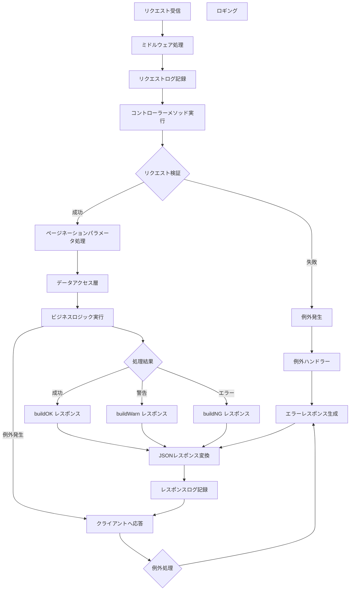

# コントローラー設計書

## 0. 処理フロー図



## 1. 概要

このドキュメントは、システム内のコントローラーの設計と実装の詳細を説明します。コントローラーは、APIリクエストの処理とレスポンスの生成を担当します。

## 2. コントローラーの階層構造

### 2.1 ApiController (基底クラス)
- **目的**: 共通のAPI機能を提供
- **機能**:
  - レスポンス生成
  - エラーハンドリング
  - ロギング
  - ページネーション

### 2.2 StubController (具象クラス)
- **目的**: 特定のAPIエンドポイントの実装
- **機能**:
  - ビジネスロジックの実装
  - データアクセス
  - リクエスト検証

## 3. コントローラー構造

### 3.1 ApiController 基本構造
```php
abstract class ApiController extends Controller
{
    protected function buildOK($data = null, $messages = null)
    {
        // 成功レスポンス生成
    }
    
    protected function buildWarn($data = null, $messages = null)
    {
        // 警告レスポンス生成
    }
    
    protected function buildNG($data = null, $messages = null)
    {
        // エラーレスポンス生成
    }
    
    protected function log($level, $code, $messages)
    {
        // ロギング実装
    }
}
```

### 3.2 StubController 実装例
```php
class StubController extends ApiController
{
    public function someAction(Request $request)
    {
        try {
            // リクエスト検証
            // ビジネスロジック実行
            // レスポンス生成
        } catch (Exception $e) {
            return $this->handleException($e);
        }
    }
}
```

## 4. レスポンス生成

### 4.1 レスポンスタイプ
- OK (成功)
- WARN (警告)
- NG (エラー)

### 4.2 レスポンス構造
```json
{
    "status": "OK",
    "code": 200,
    "data": {},
    "messages": []
}
```

## 5. エラー処理

### 5.1 例外タイプ
- ValidationException
- BusinessLogicException
- SystemException

### 5.2 エラーハンドリング
- 例外のキャッチ
- エラーログ記録
- 適切なレスポンス生成

## 6. ロギング

### 6.1 ログレベル
- INFO: 通常操作
- WARNING: 潜在的な問題
- ERROR: 失敗した操作
- DEBUG: 詳細なデバッグ情報

### 6.2 ログコンテキスト
- リクエスト情報
- レスポンス情報
- エラー情報
- 実行時間

## 7. ページネーション

### 7.1 パラメータ
- limit: 取得件数
- offset: 開始位置

### 7.2 実装
```php
protected function getPaginationParams(Request $request)
{
    return [
        'limit' => $request->input('limit', 10),
        'offset' => $request->input('offset', 0)
    ];
}
```

## 8. セキュリティ

### 8.1 認証
- APIトークン認証
- セッション管理

### 8.2 認可
- ロールベースのアクセス制御
- 権限チェック

## 9. パフォーマンス

### 9.1 最適化
- キャッシュの活用
- クエリの最適化
- レスポンスの圧縮

### 9.2 モニタリング
- レスポンス時間
- メモリ使用量
- エラー率

## 10. テスト

### 10.1 単体テスト
- コントローラーメソッド
- レスポンス生成
- エラー処理

### 10.2 統合テスト
- APIエンドポイント
- 認証/認可
- データ整合性

## 11. メンテナンス

### 11.1 定期的なタスク
- ログ確認
- パフォーマンス監視
- エラー分析

### 11.2 緊急対応
- エラー発生時の対応
- システム復旧
- データ整合性確認 
